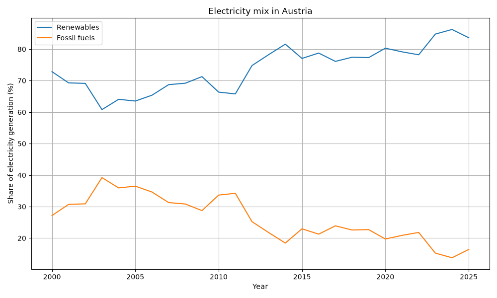
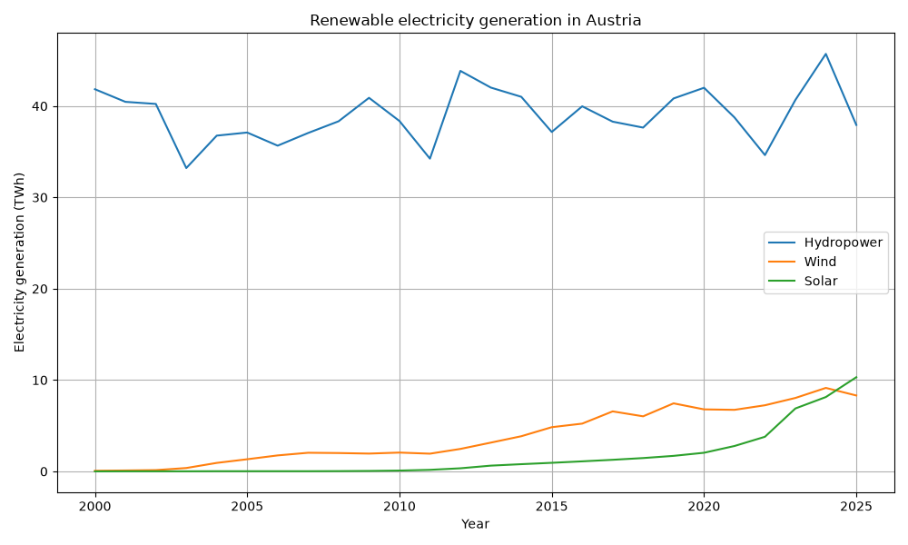
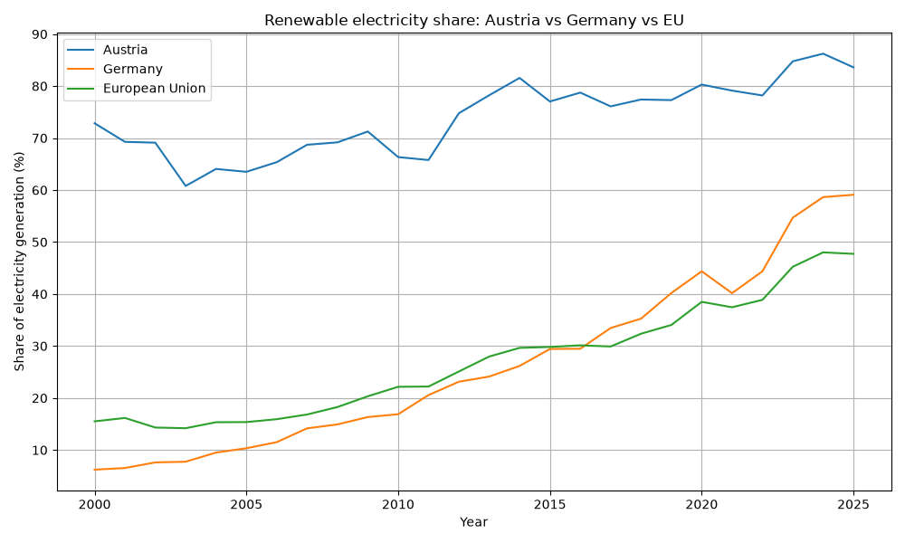

# Austria Energy Data Analysis

This project analyzes the development of Austria's electricity mix since 2000 using publicly available energy data from Our World in Data.

The goal is to explore how renewable and fossil electricity generation have changed over time and to visualize the development of hydropower, wind and solar energy.

## Technologies

- Python
- pandas
- matplotlib
- Git
- GitHub

## Data

The project uses the Our World in Data Energy Dataset.

The analysis focuses on Austria and uses data from the year 2000 onwards.

## Analysis

The project currently examines:

- renewable vs. fossil electricity generation
- renewable electricity share
- hydropower generation
- wind power generation
- solar power generation

## Key Findings

- Austria's renewable electricity share increased from **72.8% in 2000** to **83.6% in 2025**, representing an increase of **10.8 percentage points**.
- The highest renewable electricity share in the dataset was **86.2% in 2024**.
- Wind electricity generation increased from just **0.07 TWh in 2000** to **8.31 TWh in 2025**.
- Solar electricity generation grew from virtually **0 TWh in 2000** to **10.31 TWh in 2025**.
- While hydropower remains a major component of Austria's renewable electricity system, the data shows substantial growth in **wind and especially solar generation** since 2000.
- In 2025, Austria's renewable electricity share reached **83.6%**, compared with **59.1% in Germany** and **47.7% in the European Union**.
- Austria's renewable electricity share was therefore **24.5 percentage points higher than Germany's** and **35.9 percentage points higher than the EU average** in 2025.

## Visualizations

### Renewable vs. fossil electricity



### Renewable electricity generation



### Austria vs. Germany vs. European Union



## Project Structure
output/
├── austria-electricity-mix.png
├── austria-renewable-generation.png
├── renewable-share-country-comparison.png
└── key_findings.txt

## Installation

Clone the repository:

```bash
git clone https://github.com/kadirtoyran/energy-data-analysis.git
```

Install the required Python packages:

```bash
pip install -r requirements.txt
```

Run the analysis:

```bash
python src/analysis.py
```

## Possible Future Improvements

- compare additional European countries
- analyze electricity demand and generation per capita
- add interactive visualizations
- automate data retrieval from an API